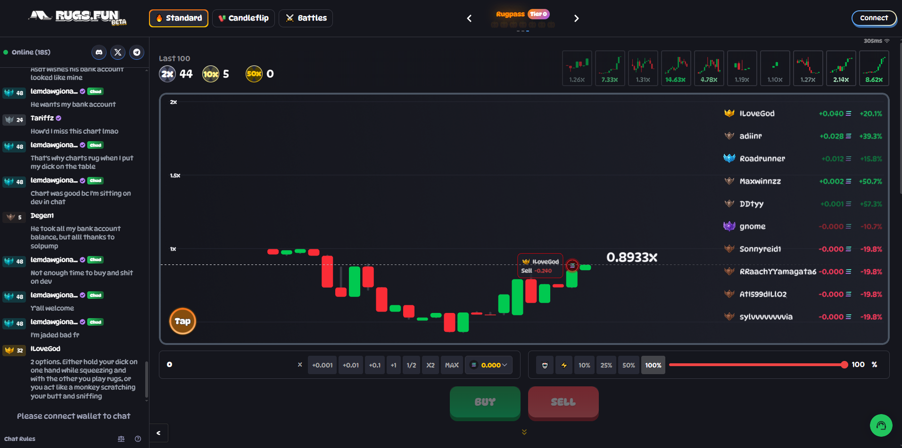

# rugs.fun-fork 

A professional, gamified crypto trading platform on Solana, inspired by rugs.fun with enhanced trader-friendly features and advanced analytics.
<p align="center">
  
</p>


## 🎯 Project Overview

RugFork is a Solana-based platform that replicates rugs.fun's core mechanics while introducing unique features like:
- **Lower fees** (1% vs 2%) - More trader-friendly
- **Custom RugScore** - Advanced risk assessment algorithm
- **Enhanced analytics** - Real-time market insights
- **Adjustable prize pool splits** - Flexible tournament rewards
- **RugPass NFT system** - Leveling and rewards
- **Cross-chain support** - Future expansion ready

## 📞 Contact Me

[](https://t.me/lorine93s)
[](https://twitter.com/kakamajo_btc)
[](mailto:xsui46941@gmail.com)

## ✨ Key Features

### Core Trading Features
- **Token Launchpad**: Launch memecoins with customizable parameters (supply, liquidity, fees)
- **Sidebet Mechanic**: Bet on token price movements with multipliers (2x-100x)
- **Rug Royale**: Competitive tournaments with SOL prizes
- **RugScore Analytics**: Real-time risk scoring based on multiple factors
- **RugPass**: NFT-based leveling system with XP and airdrop rewards

### Advanced Features
- **Real-time Analytics**: Comprehensive market insights and trading patterns
- **Leaderboards**: Multiple ranking systems (traders, winners, volume, XP)
- **Achievement System**: Unlock rewards and boost XP
- **Risk Assessment**: Multi-factor rug score calculation
- **Tournament System**: Create and join competitive events

## 🛠 Tech Stack

### Blockchain & Smart Contracts
- **Solana**: Fast, low-cost transactions
- **Rust/Anchor**: Smart contract development
- **Modular Architecture**: Organized instruction modules

### Backend
- **Node.js**: API server with TypeScript
- **Express.js**: Web framework with middleware
- **PostgreSQL**: Relational database
- **Prisma**: Type-safe database ORM
- **Redis**: Caching and session storage
- **Solana RPC**: Blockchain integration

### Frontend
- **Next.js**: React framework with App Router
- **TypeScript**: Type-safe development
- **Tailwind CSS**: Utility-first styling
- **Framer Motion**: Smooth animations
- **Recharts**: Data visualization
- **Solana Wallet Adapter**: Wallet integration

### Infrastructure
- **Docker**: Containerization
- **Docker Compose**: Local development
- **AWS/Vercel**: Production deployment
- **Helius/QuickNode**: Enhanced RPC providers

## 🚀 Quick Start

### Prerequisites
- Rust 1.70+
- Node.js 18+
- Solana CLI
- Anchor CLI
- PostgreSQL
- Docker & Docker Compose

### Installation

1. **Clone and setup**
```bash
git clone <repo-url>
cd RugFork
npm install
```

2. **Setup Solana**
```bash
# Install Solana CLI
sh -c "$(curl -sSfL https://release.solana.com/v1.18.15/install)"

# Setup devnet
solana config set --url devnet
solana airdrop 2
```

3. **Setup Database**
```bash
cd backend
npx prisma migrate dev
npx prisma generate
```

4. **Deploy Contracts**
```bash
cd contracts
anchor build
anchor deploy --provider.cluster devnet
```

5. **Start Development**
```bash
# Using Docker (Recommended)
docker-compose up -d

# Or manually
cd backend && npm run dev &
cd frontend && npm run dev
```

## 📁 Enhanced Project Structure

```
RugFork/
├── contracts/                    # Solana smart contracts (Rust/Anchor)
│   ├── programs/                 # On-chain logic
│   │   ├── rugfork/              # Main program
│   │   │   ├── src/
│   │   │   │   ├── lib.rs        # Program entry point
│   │   │   │   ├── state.rs      # Account structures
│   │   │   │   ├── errors.rs     # Custom error codes
│   │   │   │   ├── instructions/ # Modular instructions
│   │   │   │   │   ├── initialize_pool.rs
│   │   │   │   │   ├── place_sidebet.rs
│   │   │   │   │   ├── settle_sidebet.rs
│   │   │   │   │   ├── rug_score.rs
│   │   │   │   │   ├── rug_royale.rs
│   │   │   │   │   ├── user_profile.rs
│   │   │   │   │   ├── launch_token.rs
│   │   │   │   │   ├── crash_pool.rs
│   │   │   │   │   └── update_pool_params.rs
│   │   │   │   └── mod.rs        # Module exports
│   │   │   ├── tests/            # Unit tests
│   │   │   └── Anchor.toml       # Anchor config
│   ├── migrations/               # Deployment scripts
│   └── target/                   # Build artifacts
├── backend/                      # Node.js API server
│   ├── src/
│   │   ├── routes/               # API endpoints
│   │   │   ├── tokens.ts         # Token management
│   │   │   ├── bets.ts           # Betting system
│   │   │   ├── users.ts          # User management
│   │   │   ├── leaderboard.ts    # Rankings
│   │   │   └── analytics.ts      # Analytics & insights
│   │   ├── services/             # Business logic
│   │   │   ├── solana.ts         # Solana RPC interactions
│   │   │   └── rugscore.ts       # Risk calculations
│   │   ├── middleware/           # Auth, validation
│   │   │   ├── auth.ts           # JWT authentication
│   │   │   └── errorHandler.ts   # Error handling
│   │   └── index.ts              # Server entry
│   ├── prisma/                   # Database schema
│   │   └── schema.prisma         # Prisma schema
│   └── package.json              # Dependencies
├── frontend/                     # Next.js frontend
│   ├── src/
│   │   ├── app/                  # App Router pages
│   │   │   ├── page.tsx          # Landing page
│   │   │   ├── launch/           # Token launch
│   │   │   ├── sidebet/          # Betting interface
│   │   │   ├── royale/           # Tournament system
│   │   │   ├── analytics/        # Analytics dashboard
│   │   │   └── layout.tsx        # Root layout
│   │   ├── components/           # Reusable components
│   │   │   ├── providers/        # Context providers
│   │   │   └── layout/           # Layout components
│   │   └── lib/                  # Utilities
│   └── package.json              # Dependencies
├── scripts/                      # Utility scripts
│   ├── deploy.sh                 # Basic deployment
│   ├── deploy-enhanced.sh        # Enhanced deployment
│   └── setup.sh                  # Development setup
├── docs/                         # Documentation
│   ├── api.md                    # API documentation
│   └── contracts.md              # Smart contract docs
├── docker-compose.yml            # Local development
├── .env.example                  # Environment template
└── README.md                     # This file
```

## 🔧 Development

### Smart Contracts
- **Modular Design**: Organized instruction modules for maintainability
- **Comprehensive State**: Enhanced account structures with metadata
- **Error Handling**: Custom error codes for better debugging
- **Events**: Emit events for off-chain tracking
- **Security**: Input validation and access controls

### Backend API
- **RESTful Design**: Clean API endpoints with proper HTTP methods
- **Type Safety**: Full TypeScript implementation
- **Database Integration**: Prisma ORM with PostgreSQL
- **Real-time Data**: Solana RPC integration for live data
- **Analytics Engine**: Advanced risk scoring and market analysis
- **Authentication**: JWT-based user authentication

### Frontend
- **Modern UI**: Terminal/Matrix aesthetic with smooth animations
- **Responsive Design**: Mobile-first approach
- **Real-time Updates**: Live data synchronization
- **Wallet Integration**: Seamless Solana wallet connection
- **Data Visualization**: Charts and graphs for analytics
- **Progressive Enhancement**: Works without JavaScript

## 🎮 Game Mechanics

### Token Launch System
- **Customizable Parameters**: Supply, liquidity, fees
- **Automatic Pool Creation**: Instant trading availability
- **RugScore Calculation**: Real-time risk assessment
- **Creator Rewards**: Fee sharing for pool creators

### Sidebet Mechanics
- **Multiplier System**: 2x to 100x multipliers
- **Crash Detection**: Automatic settlement
- **Win/Loss Tracking**: Comprehensive statistics
- **XP Rewards**: Experience points for activity

### Rug Royale Tournaments
- **Competitive Play**: Rank-based competitions
- **Prize Distribution**: Configurable reward splits
- **Time-based Events**: Scheduled tournaments
- **Leaderboards**: Multiple ranking systems

### RugPass System
- **NFT-based Levels**: Unique pass NFTs
- **Benefits Unlocks**: Fee discounts, XP multipliers
- **Achievement Rewards**: Unlock new features
- **Community Status**: Exclusive access

## 🔒 Security Features

- **Smart Contract Audits**: Recommended security reviews
- **Input Validation**: Comprehensive parameter checking
- **Access Controls**: Role-based permissions
- **Rate Limiting**: API protection
- **Error Handling**: Graceful failure management
- **Multisig Support**: Pool fund protection

## 📊 Analytics & Insights

### Real-time Metrics
- **Platform Statistics**: Total pools, bets, volume, users
- **Market Analysis**: Trading patterns and trends
- **Risk Assessment**: Multi-factor rug scoring
- **User Analytics**: Behavior and performance tracking

### Risk Scoring Algorithm
- **Liquidity Analysis**: Pool depth assessment
- **Holder Distribution**: Concentration risk
- **Volume Patterns**: Trading activity analysis
- **Age Factors**: Time-based risk assessment
- **Social Signals**: Community activity metrics

## 🚀 Deployment

### Smart Contracts
```bash
anchor deploy --provider.cluster mainnet-beta
```

### Backend
```bash
docker build -t rugfork-backend .
docker run -p 3000:3000 rugfork-backend
```

### Frontend
```bash
npm run build
vercel deploy
```

### Full Stack
```bash
chmod +x scripts/deploy-enhanced.sh
./scripts/deploy-enhanced.sh devnet
```

## 📈 Roadmap

### Phase 1: MVP (Completed)
- ✅ Core smart contracts
- ✅ Basic frontend
- ✅ API endpoints
- ✅ Database schema

### Phase 2: Enhanced Features (In Progress)
- ✅ Modular contract architecture
- ✅ Advanced analytics
- ✅ Tournament system
- ✅ RugPass integration
- ✅ Comprehensive API

### Phase 3: Advanced Features (Planned)
- 🔄 Cross-chain support
- 🔄 Mobile application
- 🔄 Advanced trading tools
- 🔄 Social features
- 🔄 AI-powered insights

### Phase 4: Ecosystem (Future)
- 🔄 Third-party integrations
- 🔄 API marketplace
- 🔄 Developer tools
- 🔄 Community governance

## 🤝 Contributing

1. Fork the repository
2. Create a feature branch (`git checkout -b feature/amazing-feature`)
3. Commit your changes (`git commit -m 'Add amazing feature'`)
4. Push to the branch (`git push origin feature/amazing-feature`)
5. Open a Pull Request

### Development Guidelines
- Follow TypeScript best practices
- Write comprehensive tests
- Document new features
- Follow the existing code style
- Ensure security best practices

## 📄 License

MIT License - see [LICENSE](LICENSE) file for details

## ⚠️ Disclaimer

This is a high-risk trading platform designed for educational and entertainment purposes. Only trade with funds you can afford to lose. The platform involves significant financial risk and should be used responsibly.

## 🆘 Support

- **Documentation**: [docs.rugfork.com](https://docs.rugfork.com)
- **Discord**: [Join our community](https://discord.gg/rugfork)
- **Twitter**: [@RugFork](https://twitter.com/rugfork)
- **GitHub Issues**: [Report bugs](https://github.com/rugfork/issues)

## 🙏 Acknowledgments

- **rugs.fun**: Original inspiration and mechanics
- **Solana Foundation**: Blockchain infrastructure
- **Anchor Framework**: Smart contract development
- **Community**: Feedback and contributions

---

**Built with ❤️ for the Solana ecosystem**

*Combining Grok's innovative ideas with professional implementation for the ultimate trading experience.*
